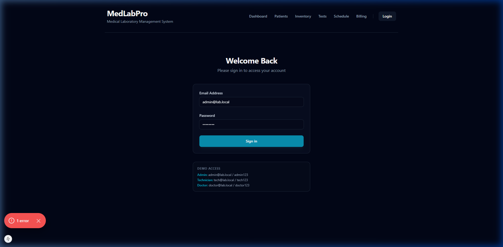
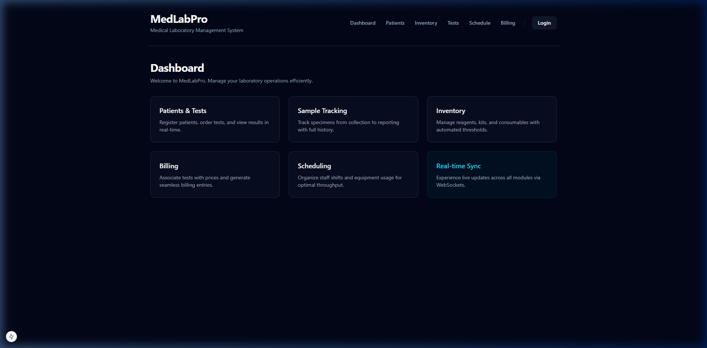
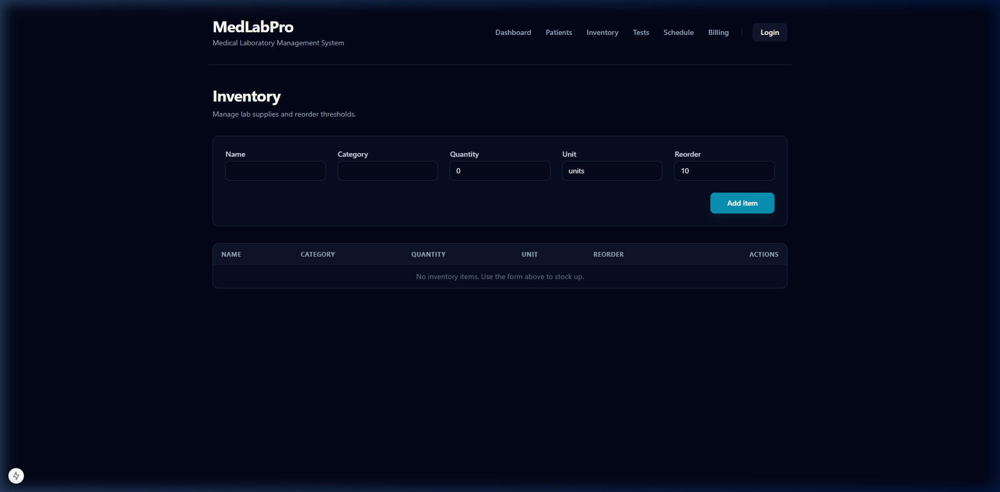
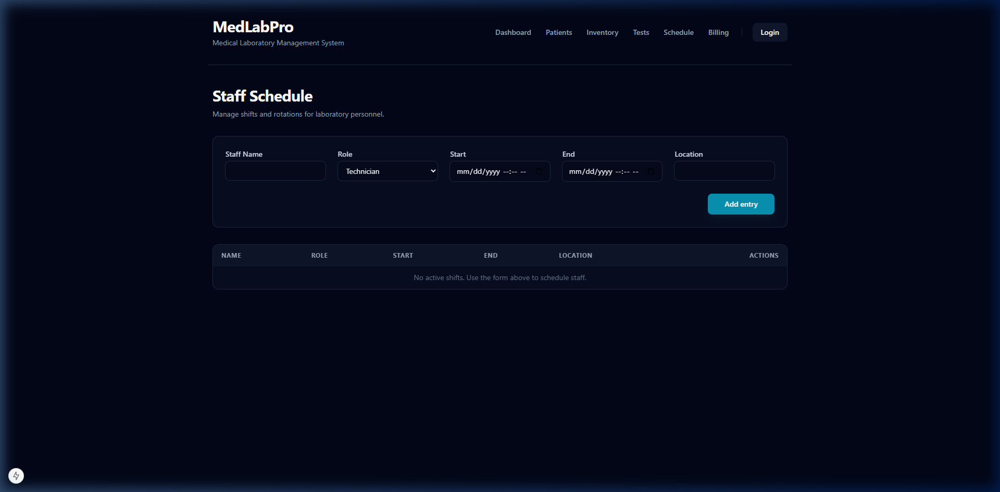
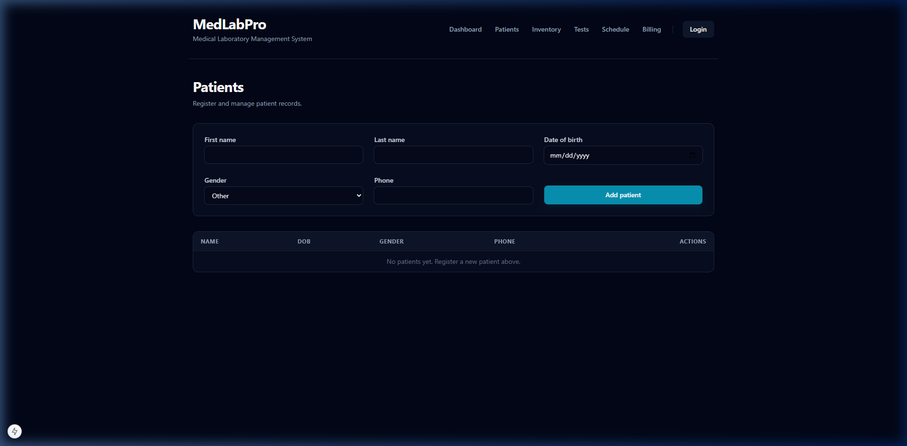
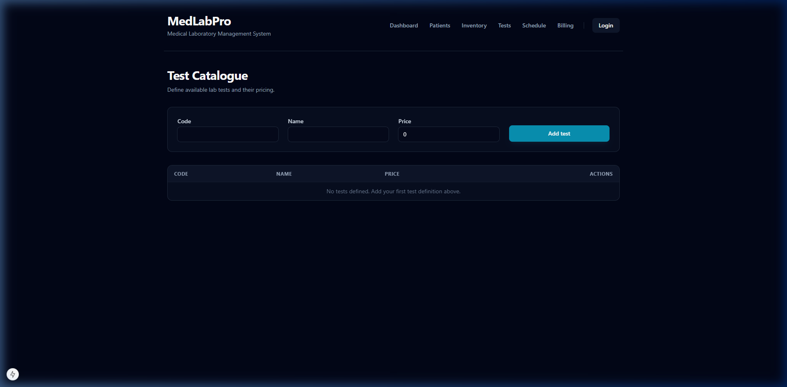
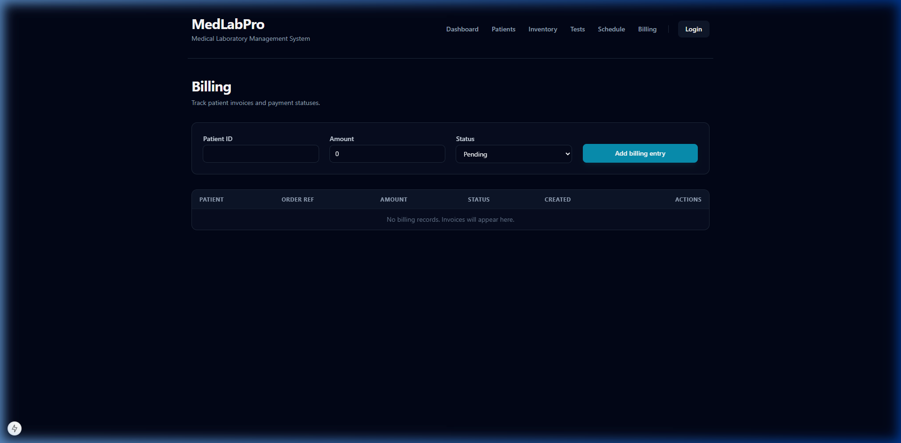

<p align="center">
  
  
  
  
  
  
  
  
</p>

# 🧪 MedLabPro

> **MedLabPro** is a professional-grade Medical Laboratory Management System designed for precision, speed, and real-time laboratory orchestration.

The system focuses on **pixel-perfect symmetry**, **symmetric information architecture**, and a **high-performance fullstack architecture** aimed at providing laboratory staff with a frictionless digital workspace.

---

# 🎬 Project Demonstration

The following resources demonstrate the system's behavior:

- [📸 Screenshots of key features](#-screenshots)
- [🏗️ System architecture overview](#️-architecture-overview)
- [🧠 Engineering lessons](#-engineering-lessons)
- [🔧 Design decisions](#-key-design-decisions)
- [🗺️ Roadmap](#️-roadmap)
- [🚀 Future improvements](#-future-improvements)
- [📄 Documentation](#-documentations)
- [📝 License](#-license)
- [📩 Contact](#-contact)

---

# ✨ Key Features

| Feature | Description |
|---|---|
| **Patient Management** | Full CRUD capabilities with secure registry and medical history tracking. |
| **Real-time Sync** | Live status updates across all roles via Socket.io (NestJS Gateways). |
| **Test Catalogue** | Centralized laboratory test definitions with dynamic pricing and coding. |
| **Inventory Control** | Automated reagent and supply tracking with reorder thresholds. |
| **RBAC Security** | Role-based navigation and access for Admins, Technicians, and Doctors. |
| **Local Persistence** | Integrated IndexedDB ensures data resilience against network interruptions. |

---

# 📸 Screenshots

The following screenshots demonstrate the symmetric, professional UI across all system modules:

### 🔐 Common: Secure Login


### 📊 Common: Dashboard & Analytics


### 📦 Admin: Inventory Tracking


### 🗓️ Admin: Staff Scheduling


### 👥 Technician: Patient Registry


### 📑 Technician: Test Management


### 💳 Technician: Financial Billing


---

# 🏗️ Architecture Overview

MedLabPro is implemented using a **Decoupled Clean Architecture** with a **Modular Folder Pattern**.

### Pattern & Structure
- **Monorepo-Style**: Unified workspace with strictly separated `frontend/` and `backend/` contexts.
- **Backend (NestJS)**: Follows the **Modular Architecture Pattern**, where logic is encapsulated into self-contained feature modules (Auth, Patients, Inventory, etc.).
- **Frontend (Next.js)**: Utilizes the **App Router Pattern** with a **Domain-Driven Directory** structure, ensuring a clean separation between UI components and business logic.

### Frontend
- [Next.js 15 (App Router)](https://nextjs.org/)
- [Tailwind CSS (Premium Glassmorphism Design)](https://tailwindcss.com/)
- [Socket.io Client](https://socket.io/)

### Backend
- [NestJS 11 (Modular Backend)](https://nestjs.com/)
- [Socket.io Server (Gateways)](https://socket.io/)
- [In-Memory Persistence (JS Map based for demo speed)](https://developer.mozilla.org/en-US/docs/Web/JavaScript/Reference/Global_Objects/Map)
- [Supabase](https://supabase.com/)

### Communication
- **RESTful API** for primary CRUD operations.
- **WebSockets (Socket.io)** for bidirectional real-time event broadcasting.

### Persistence
- **Client-Side**: [IndexedDB](https://developer.mozilla.org/en-US/docs/Web/API/IndexedDB_API) via `idb` library.
- **Server-Side**: In-memory storage for zero-overhead initial setup. (Migration to **Supabase** planned).

---

# 🧠 Engineering Lessons

Developing MedLabPro involved a deep dive into building real-time, resilient systems:

- **WebSocket Orchestration**: Implementing a clean, event-driven architecture by decoupling business logic from communication gateways.
- **Fullstack Workspace Pattern**: Synchronizing domain models across strictly separated Next.js and NestJS projects to eliminate "API drift".
- **State Resilience**: Leveraging **IndexedDB** for asynchronous, structured browser storage, ensuring data persistence beyond simple LocalStorage.
- **Modular Domain Design**: Utilizing NestJS module boundaries to manage complexity and prevent circular dependencies in a growing system.
- **UI Standardisation**: Mastering Tailwind CSS utility tokens and a global design layer to achieve 100% layout symmetry.
- **Security-First Mindset**: Implementing defense-in-depth with Helmet, BCrypt hashing, and secure HTTP-only cookie management.

- **[Read more in Engineering Lessons...](docs/engineering_lessons.md)**

---

# 🔧 Key Design Decisions

1. **Decoupled Clean Architecture**
   Implementing a strict monorepo-style separation between frontend and backend to ensure high separation of concerns and independent scalability.

2. **Zero-Configuration Demo Flow**
   Prioritizing instant "Clone & Run" capability by using in-memory backend storage, removing setup friction for recruitment reviews.

3. **Unified Role-Based UI**
   Utilizing a single, robust layout with conditional rendering to maintain brand consistency while strictly enforcing role-based access.

4. **Premium "Pro-Lab" Aesthetics**
   Choosing a high-contrast Slate/Cyan palette with glassmorphism to differentiate the system from legacy clinical software.

5. **Socket.io for Event-Driven UX**
   Opting for WebSockets over polling to provide the low-latency, bi-directional communication required for critical clinical alerts.

6. **Cloud Scaling Roadmap**
   Strategically planning the transition to **Supabase** (PostgreSQL) to move from a high-speed demo to a production-ready persistent infrastructure.

- **[Read more in Design Decisions...](docs/design_decisions.md)**

---

# 🗺️ Roadmap

Key status of features planned for MedLabPro:

- ✅ **Core Rebranding** — Complete transition to the "MedLabPro" identity.
- ✅ **UI Design** — Professional and modern UI design for all core views.
- 🟡 **Business Logic** — (In Progress) Business logic for different user roles.
- 🟡 **Real-time Sync** — (In Progress) Live updates between different user roles.
- 🟡 **Role Based Access Control** — (In Progress) Role based access control for different user roles.
- ⭕ **Supabase Integration** — (In Progress) Transitioning from in-memory to Supabase for persistent cloud storage.
- ⭕ **Advanced Reporting** — (In Progress) PDF result generation and automated emails.


---

# 🚀 Future Improvements

Planned enhancements include:
- Full **Supabase Database** integration for cloud-based data persistence.
- Machine Learning assisted test result anomaly detection.
- Cross-laboratory data exchange protocols (FHIR/HL7).
- Full offline capability with background synchronization workers.

---

## 🗂️ Documentations

Additional documentation is available in the `docs/` folder:

| File | Description |
|---|---|
| [🏗️ Architecture](docs/architecture.md) | Technical stack and data flow overview. |
| [✨ Features](docs/features.md) | Detailed breakdown of functional capabilities. |
| [🚀 Setup Guide](docs/setup_guide.md) | Step-by-step instructions for local setup and Docker. |
| [🧠 Engineering Lessons](docs/engineering_lessons.md) | Deep dive into technical challenges and learnings. |
| [🔧 Design Decisions](docs/design_decisions.md) | Rationale behind key architectural choices. |

---

# ⚙️ Setup & Database Configuration

MedLabPro is designed for **instant deployment**.

### 📦 GitHub Installation
1. Clone the repository.
2. Run `npm install` in both `frontend/` and `backend/` folders.
3. Start the services with `npm run dev` (frontend) and `npm run start:dev` (backend).

### 🐳 Docker Setup
Run the following command in the root directory:
```bash
docker-compose up --build
```

### 🗄️ Database
Currently, the system uses **In-Memory** storage for the backend and **IndexedDB** for the frontend. 
**Coming Soon**: Integration with [Supabase](https://supabase.com/) for persistent PostgreSQL storage and authentication.

---

# 📝 License

This project is licensed under the **Apache License 2.0**.
**MedLabPro is an open-source project and contributions are highly encouraged!**

The source code is published for **portfolio, educational review, and open-source contribution purposes**.

© 2026 [Viraj Tharindu](https://github.com/VirajTharindu) — Licensed under the Apache License, Version 2.0.

---

# 📩 Contact

If you are reviewing this project as part of a hiring process or are interested in the technical approach, feel free to reach out.

**Opportunities for collaboration or professional roles are always welcome.**

📧 Email: [virajtharindu1997@gmail.com](mailto:virajtharindu1997@gmail.com)  
💼 LinkedIn: [viraj-tharindu](https://www.linkedin.com/in/viraj-tharindu/)  
🌐 Portfolio: [vjstyles.com](https://viraj-tharindu.github.io/)  
🐙 GitHub: [VirajTharindu](https://github.com/VirajTharindu)  

---

<p align="center">
  <em>Better Data. Better Decisions. MedLabPro.</em>
</p>
