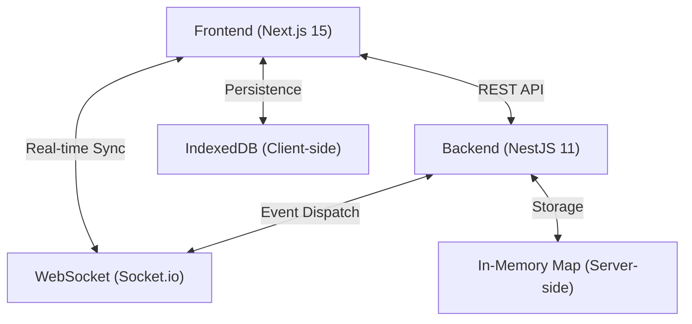

# 🏗️ System Architecture Overview

MedLabPro is built with a modern, decoupled architecture designed for high performance, real-time synchronization, and a premium user experience.

## 📐 High-Level Architecture

The system follows a **Decoupled Clean Architecture** pattern with a focus on real-time data flow and local persistence. 

### 📂 Folder Architecture Pattern
- **Workspace Root**: Contains strictly separated `frontend/` and `backend/` directories, following a monorepo-like organization.
- **Backend (NestJS)**: Implements a **Modular Pattern**. Each business domain (e.g., `patients`, `inventory`) is isolated into its own module containing its controllers, services, and DTOs.
- **Frontend (Next.js)**: Employs the **App Router Pattern** combined with a `src/domain` directory for cross-cutting types and `src/app` for route-specific layouts and components.

---

## 💻 Frontend Layer
- **Framework**: [Next.js 15](https://nextjs.org/) (App Router)
- **Styling**: [Tailwind CSS](https://tailwindcss.com/) with a custom design system for glassmorphism and symmetry.
- **State Management**: React Hooks (useState, useEffect) for component-level state.
- **Local Persistence**: [IndexedDB](https://developer.mozilla.org/en-US/docs/Web/API/IndexedDB_API) via the `idb` library to ensure data survives page refreshes even without a persistent backend database.

## ⚙️ Backend Layer
- **Framework**: [NestJS 11](https://nestjs.com/) (Modular Architecture)
- **Security**: 
  - [Helmet](https://helmetjs.github.io/) for secure HTTP headers.
  - [BCrypt](https://en.wikipedia.org/wiki/Bcrypt) for password hashing.
  - Cookie-based authentication for secure session handling.
- **In-Memory Storage**: Data is managed using JS `Map` objects on the server during the demo phase.
- **Supabase (Roadmap)**: Planned transition to Supabase for persistent, secure cloud storage.

## 📡 Communication & Real-time Sync
- **Messaging**: [Socket.io](https://socket.io/) integration for live status updates across different users (Admin, Tech, Doctor).
- **API**: RESTful endpoints developed with NestJS controllers for standard CRUD operations.

## 📂 Data Model
The system uses a shared domain model for:
- `Patients`: Registry data and medical history.
- `Tests`: Definitions and pricing for laboratory tests.
- `Orders`: Tracking test results and statuses.
- `Inventory`: Managing reagents and consumables.
- `Billing`: Handling invoices and payments.
